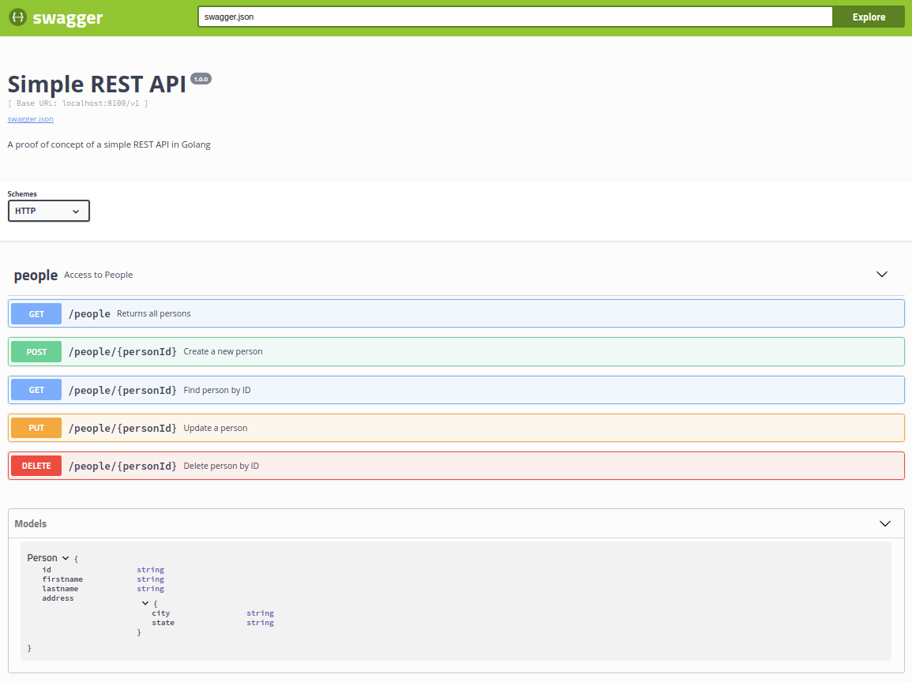

# Simple REST API

A proof of concept of a simple REST API in Golang.

All data is held in memory, all transfer is via JSON.

All testing can be with __curl__ or __Swagger__ - although Postman should work too.

## Features

- uses Gorilla MUX (github.com/gorilla/mux)
- returns appropriate HTTP status codes
- modify Person method implemented
- uses __JSON__
 
In __Firefox__ at least, specifying "application/json" allows interpretation of the JSON:

## Installation

- __Go__ is required (version 1.7 or later)

Fetch this project as follows:

	$ go get -u github.com/mramshaw/Simple-REST-API

This could also be done with __git__ of course:

	$ git clone https://github.com/mramshaw/Simple-REST-API.git

Any dependencies will be fetched in the __build__ process.

## Building

- __make__ is required

This will fetch all dependencies and build the executable:

	$ make

All dependencies will be stored in a local __go__ directory.

## Unit Tests

- __make__ is required

This will run the unit tests for the DAO:

	$ make test

The unit tests will be run in __verbose__ mode.

## Usage

Simply run the go code (Ctrl-C to terminate):

	$ go run RestfulGorillaMux.go

Or run the executable (Ctrl-C to terminate):

	$ ./RestfulGorillaMux

The API will then be accessible at:

	http://localhost:8100/v1/people

[Note that the API is __versioned__ (which is probably a best practice).]

## Testing

Use the following __curl__ commands to test (or use the Swagger UI as shown below).

GET (All):

	$ curl -v localhost:8100/v1/people

GET (Individual):

	$ curl -v localhost:8100/v1/people/5

	$ curl -v localhost:8100/v1/people/1

POST (Create):

	$ curl -v -X POST -H "Content-Type: application/json"   \
	       -d '{"firstname":"Tommy","lastname":"Smothers"}' \
	       localhost:8100/v1/people/5

PUT (Update):

	$ curl -v -X PUT -H "Content-Type: application/json" \
	       -d '{"firstname":"Tom","lastname":"Smothers","address":{"city":"Hollywood","state":"CA"}}' \
	       localhost:8100/v1/people/5

DELETE (Delete):

	$ curl -v -X DELETE -H "Content-Type: application/json" \
	       localhost:8100/v1/people/5

[Specifying __-v__ shows the HTTP status codes; this can be omitted if the status codes are not of interest.]

## Swagger

Although Postman is pretty nice, I've always found Swagger to be a better experience.

The content can be served from __swagger-ui__ (which uses __node__ and __npm__).

On linux, CORS (Cross Origin Resource Sharing) may be temporarily disabled for __chromium__ as follows:

    $ chromium-browser --disable-web-security --user-data-dir

## To Do

- [x] Return appropriate HTTP status codes
- [x] Implement code to modify a Person
- [x] Modify to use __JSON__
- [x] Implement API versioning
- [x] Add a SWAGGER definition
- [x] Implement CORS (Cross Origin Resource Sharing) handling
- [x] Refactor data access into a DAO module
- [x] Add tests for the DAO
- [ ] Implement a persistent back-end
- [ ] Investigate upgrading to HTTP2

## Credits

Based (with many changes and additions) upon this great tutorial by Nic Raboy:

	https://www.thepolyglotdeveloper.com/2016/07/create-a-simple-restful-api-with-golang/

There is also a YouTube video (which is linked to from the article).
